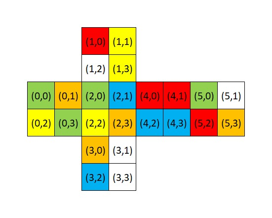

# 2x2 Rubik's Cube Solver
This is a Python script to find the optimal solution of 2x2 Rubik's Cube using Breadth-First Search.

## Usage
- Clone this repository.
- Make sure Python is installed in your local machine.
- Edit the 2D list in [example.py](example.py) (refer the example below).

Example:



```python
cube = [
    ["G", "O", "Y", "G"],
    ["R", "Y", "W", "Y"],
    ["G", "B", "Y", "O"],
    ["O", "W", "B", "W"],
    ["R", "R", "B", "B"],
    ["G", "W", "R", "O"]
]
```

- Run ```python example.py``` in the terminal.

## Solution
The number of state explored and solution will be shown in the terminal.

The solution will be based on the [Rubik's Cube Notation](https://ruwix.com/the-rubiks-cube/notation/).

## License
[MIT](LICENSE)